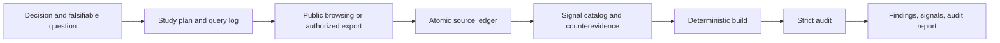

# Community Signal Research

[](https://agentskills.io/specification)
[](https://www.python.org/)
[](scripts/community_signal.py)
[](LICENSE)

Turn public community conversations into ranked, reproducible demand hypotheses—not market-validation theater.

`community-signal-research` is a portable Agent Skill for Reddit, GitHub Issues and Discussions, Hacker News, public forums, and user-supplied discussion exports. It gives an agent a conservative research method and a standard-library-only Python auditor that checks the evidence ledger before a finding can ship.

The skill is designed for questions such as:

- Which recurring workflow deserves a product or skill?
- What problems are people actually working around?
- Which feature request recurs across independent discussions?
- What evidence contradicts a proposed opportunity?
- Is there explicit purchase evidence, or only visible frustration?

It is not a representative survey, a market-sizing model, a sentiment profiler, or a web scraper.

## Why use it

Community research fails quietly. One viral thread becomes “everyone wants this”; cross-posts become independent votes; frustration becomes assumed willingness to pay; short snippets drift away from their sources; and the queries that found nothing disappear from the final story.

This skill makes those shortcuts visible:

- **Atomic source ledger:** one observed post, comment, issue, discussion entry, story, review, or export record per JSONL row.
- **Literal quote binding:** every excerpt must occur in the captured source text and may contain at most 25 words and 500 characters.
- **Dependency-aware counting:** canonical URLs, native platform identities, repost links, reviewed matches, and substantive exact copies collapse before recurrence is measured. Short exact boilerplate is review-gated instead of silently merged, and every collapsed group remains visible.
- **Conservative recurrence:** `recurring` requires at least three eligible observed author keys across at least two threads.
- **Promotion quarantine:** promotional and unclear sources stay visible but cannot establish positive demand.
- **Explicit WTP gate:** willingness to pay is computed only from dedicated citations containing buying, payment, budget, price, or purchase-intent language; researcher prose cannot override it.
- **Counterevidence by construction:** every signal must be targeted by a counter-oriented query.
- **Coverage disclosure:** communities, platforms, dates, truncation, concentration, exclusions, and unmet targets remain in the report.
- **Deterministic artifacts:** a fresh audit byte-compares generated outputs against the five inputs.
- **Privacy-aware provenance:** platform-namespaced, study-local HMAC keys replace raw handles; private-export excerpts are withheld while opaque locators and caller-declared source-file hashes remain traceable; a bounded output-flow scan blocks obvious contact-data and private-token overlap.

The helper performs no network calls and launches no subprocesses. Your agent or approved research tool collects evidence; the helper validates and renders it.

## How it works



The agent supplies judgment where judgment is unavoidable—query design, capture, classification, and interpretation. The Python helper enforces the parts that should not depend on eloquence or memory.

## Install

Requirements:

- Python 3.10 or newer;
- an Agent Skills-compatible client;
- browser, search, connector, API, or authorized export access for evidence collection.

The skill uses the [Agent Skills open format](https://agentskills.io/specification). Clone the repository so `SKILL.md` sits directly inside the skill directory.

### Codex

For a project-scoped Codex install, use the cross-agent `.agents/skills` directory. Replace the examples with real absolute paths:

```powershell
New-Item -ItemType Directory -Force "C:\absolute\path\to\project\.agents\skills" | Out-Null
git clone https://github.com/Mandrilsquad1441/community-signal-research.git "C:\absolute\path\to\project\.agents\skills\community-signal-research"
```

On macOS or Linux:

```bash
mkdir -p "/absolute/path/to/project/.agents/skills"
git clone https://github.com/Mandrilsquad1441/community-signal-research.git "/absolute/path/to/project/.agents/skills/community-signal-research"
```

Codex discovers personal skills under `$HOME/.agents/skills`. Invoke it explicitly when desired:

```text
Use $community-signal-research to compare recurring complaints about local-first CRM tools and recommend the next problem to validate.
```

### Claude Code

Install as either a personal skill or a project skill. The following project-scoped examples use absolute placeholder paths:

```powershell
New-Item -ItemType Directory -Force "C:\absolute\path\to\project\.claude\skills" | Out-Null
git clone https://github.com/Mandrilsquad1441/community-signal-research.git "C:\absolute\path\to\project\.claude\skills\community-signal-research"
```

```bash
mkdir -p "/absolute/path/to/project/.claude/skills"
git clone https://github.com/Mandrilsquad1441/community-signal-research.git "/absolute/path/to/project/.claude/skills/community-signal-research"
```

Claude Code documents personal skills at `~/.claude/skills/` and project skills at `.claude/skills/`; it can select a skill automatically or invoke it as `/community-signal-research`. See [Anthropic’s skill guide](https://code.claude.com/docs/en/slash-commands).

The core skill uses portable Agent Skills fields. [`agents/openai.yaml`](agents/openai.yaml) adds Codex-facing display metadata without changing the research contract.

## Quick start

Let the agent drive the workflow, or use the helper directly. In every command below, replace the quoted examples with real absolute paths. Do not run the angle-bracket placeholders literally.

### 1. Initialize a study

```powershell
python "C:\absolute\path\to\community-signal-research\scripts\community_signal.py" init "C:\absolute\path\to\my-study" --question "Which unmet reporting job recurs among independent consultants?" --decision "Choose one workflow for a prototype." --mode standard
```

```bash
python3 "/absolute/path/to/community-signal-research/scripts/community_signal.py" init "/absolute/path/to/my-study" --question "Which unmet reporting job recurs among independent consultants?" --decision "Choose one workflow for a prototype." --mode standard
```

Use `quick` for directional exploration or `standard` for a prioritization study. The effective minimum coverage floors are:

| Mode | Source units | Threads | Communities | Platforms | Counterqueries |
| --- | ---: | ---: | ---: | ---: | ---: |
| `quick` | 8 | 3 | 1 | 1 | 1 |
| `standard` | 25 | 8 | 3 | 2 | 2 |

These are audit floors, not claims that a small sample is representative.

### 2. Capture evidence

`init` creates five inputs:

```text
study-plan.json
query-log.jsonl
source-ledger.jsonl
signal-catalog.json
research-notes.json
```

It also creates a private `.author-key` secret. Before writing inputs or the secret, `init` appends a final protective block containing `.author-key`, `.csr-build.lock`, `.csr-*.tmp`, `.csr-artifacts-stage-*/`, and `.csr-artifacts-backup-*/` to the study-local `.gitignore`. Appending all five rules at the end overrides earlier negations under Git's last-match-wins behavior; initialization refuses an existing or resulting ignore file above 1 MiB. Use the secret to pseudonymize a public handle without writing that handle to the ledger:

```powershell
$OutputEncoding = [System.Text.UTF8Encoding]::new($false)
"raw-handle" | python "C:\absolute\path\to\community-signal-research\scripts\community_signal.py" author-key --study-dir "C:\absolute\path\to\my-study" --platform reddit
```

On a POSIX shell:

```bash
printf '%s' 'raw-handle' | python3 "/absolute/path/to/community-signal-research/scripts/community_signal.py" author-key --study-dir "/absolute/path/to/my-study" --platform reddit
```

The command expects at most 4,096 bytes of UTF-8 standard input and normalizes both handle and platform before a platform-namespaced HMAC. The same handle on two platforms therefore receives different study-local keys. Use PowerShell 7+ or set `$OutputEncoding` as shown before piping non-ASCII handles from Windows PowerShell. Never commit or publish `.author-key`.

Every query row must record at least one viewed result page. A row with results must show that at least one result was screened. Query/source links are reciprocal and must agree on normalized platform; a source cannot have been published after the linked query ran. Duplicate rows with the same normalized platform, query, UTC run time, and sort are rejected even if their declared intents differ. Only a qualifying, non-truncated counterquery can support `complete` countersearch.

The initialized recommendation and stop-reason text are deliberate placeholders, and `next_tests` starts empty. Validation fails until they are replaced with an evidence-bound conclusion, an actual stopping rationale, and at least one next test—even when no signal qualifies.

Read [`references/method.md`](references/method.md) for the research method, [`references/source-playbooks.md`](references/source-playbooks.md) for collection guidance, and [`references/data-contracts.md`](references/data-contracts.md) for exact schemas.

### 3. Build and audit

```powershell
python "C:\absolute\path\to\community-signal-research\scripts\community_signal.py" build "C:\absolute\path\to\my-study"
python "C:\absolute\path\to\community-signal-research\scripts\community_signal.py" audit "C:\absolute\path\to\my-study" --strict
```

A successful build writes:

```text
artifacts/audit.json
artifacts/signals.csv
artifacts/findings.md
```

`audit --strict` recomputes the analysis, requires the exact three-entry artifact set, and byte-compares all three artifacts. `build` refuses symlink, Windows-junction, and other reparse-point paths and boundedly reconciles only validated, tool-shaped interrupted transactions. `build` holds a persistent, nonblocking cross-process study lock across recovery, analysis, staging, installation, and cleanup; standalone recovery uses the same lock. A second writer fails fast without touching the active transaction. If the audit fails, repair the inputs or lower the claim—do not hand-edit generated outputs.

## What the audit proves

The offline audit can prove that:

- the local JSON/JSONL inputs match the declared schemas;
- each input is read through one regular-file descriptor with path/descriptor identity checks before and after a bounded 10 MiB-plus-one-byte read; growth, replacement, link/reparse substitution, or in-read metadata change is refused. General schema strings and JSON object keys are capped at 20,000 characters before downstream semantic normalization or parsing, with a separate 100,000-character `captured_text` cap. Dates must be `YYYY-MM-DD`; timestamps must be `YYYY-MM-DDTHH:MM:SS[.1-6 digits](Z|±HH:MM)`. Date/timestamp lexemes are capped at 10/64 characters; over-limit string/key and invalid date/timestamp payloads are never echoed;
- shared text normalization is runtime-independent: the helper pins Unicode 3.2 NFKC, a fixed whitespace table, and ASCII `A`–`Z` case mapping. Characters added after Unicode 3.2 remain literal and non-ASCII case variants are not silently merged, preventing Python's changing Unicode database from changing artifacts across supported versions;
- IDs, reciprocal references, dates, URLs, citations, and duplicate links are internally consistent; query/source platform and publication chronology agree, and duplicate query executions are rejected;
- URL dot segments, unreserved percent escapes, raw UTF-8, host case/trailing dots, IP-literal spelling, and default ports are normalized; credential-like parameter keys—including compact/camel forms such as `token`, `session`, `privateKey`, `secretKey`, `signingKey`, and `keyPairId`—obvious contact data, malformed path/generic-component escapes, raw-Unicode hosts, and nonpublic host apexes/suffixes are rejected. Literal addresses use a project-pinned special-use CIDR policy rather than version-varying Python classifications. Generic URLs preserve server-significant repeated/trailing slashes and query order, while native community hosts reject nondefault ports;
- Reddit, exact-host `github.com`, and Hacker News unit/thread identities—including normalized positive native IDs—are derived from permalinks rather than submitted IDs. GitHub subdomains and other generic public sources use their exact canonical URLs as IDs, and platform diversity comes from canonical host families rather than arbitrary labels;
- excerpts are short literal substrings of captured text, with word and character ceilings;
- positive counts exclude promotion, unknown authors, and collapsed duplicates;
- every observation's ledger value equals one public source excerpt exactly, while cross-source synthesis stays in explicitly labeled inferences; Markdown display escapes syntax and normalizes compatibility characters and whitespace;
- recurrence and WTP labels do not exceed the encoded evidence;
- coverage and counterquery requirements are visible;
- duplicate/repost group members and collapse reasons are visible for all-public groups; when any member is non-public, only source-ID membership, aggregate counts, and a generic withheld-details marker are public. Private chronology, comparison mechanism, similarity percentage, and review reason stay withheld. After every hard/transitive union, each unresolved short-text class yields one deterministic pair warning per run; private-containing pair warnings use one generic review-required form. `independent` is pair-specific, not transitive, so rerun after each review until every final-group pair is resolved;
- supplied-private rows use the `export` platform, null URLs, opaque record references, and caller-declared file hashes; repeated exact provenance pairs compare normalized community/language, UTC-equivalent `published_at`, and order-independent evidence types before declaring a conflict. Output-bearing fields receive bounded, ASCII-shaped email/phone checks with explicit runtime-independent boundaries, while identifiers and public URLs are also checked for hashed private-token overlap;
- generated artifacts reproduce deterministically from the five inputs under the documented private-text fingerprint boundary and pinned normalization policy, with each 32 MiB UTF-8 ceiling enforced incrementally while CSV, Markdown, or JSON is rendered.

The public fingerprint binds a non-public ledger row only to a syntactically valid source ID, opaque record reference, caller-declared source-file hash, and a null excerpt. All other per-record fields—including date, status, flags, classifications, evidence types, linkage metadata, and private text—are excluded. Malformed allowlist values become null, and malformed or missing visibility fails closed to this branch. Source-ID membership in controlled citation/query categories remains bound through signal citations and query inclusions. Aggregate labels/counts are deterministically recomputed outputs, not extra fingerprint inputs; the generated `signals.csv` and `findings.md` hashes bind their rendered values. This prevents the fingerprint itself from becoming a low-entropy dictionary oracle. All-public inputs retain full-field fingerprint binding. The separate output-flow scan is a bounded heuristic, not a general data-loss-prevention system: it can have false positives or miss paraphrases, encodings, or identifiers outside its patterns. Review public artifacts before publishing them.

It cannot prove that:

- a remote page was captured faithfully or still exists;
- a caller-declared private source-file hash matches the underlying export;
- two accounts are two people;
- an agent classified a passage semantically correctly;
- the search was exhaustive or free from ranking bias;
- the sample represents a population;
- a signal predicts market size, revenue, or product success.

Recheck consequential remote evidence and use interviews, experiments, analytics, or representative research before making high-stakes decisions.

## Evidence levels and ranking

Signals are declared `unsupported`, `anecdotal`, `recurring`, or `well-corroborated`. The audit rejects a declaration above the computed ceiling and the public report shows both values, so a deliberate underclaim remains the declared conclusion. A fully executed negative/null study whose signals are all declared `unsupported` can strict-pass without a no-support warning; it still receives the lower coverage score and supports only “none found in the searched coverage,” never proof of absence. Any positive-level claim without eligible support remains gated. The deterministic evidence score ranks hypotheses **inside the collected sample** using source independence, costly behavior, source diversity, recency, counterevidence, coverage, and risk penalties. It ignores engagement counts.

Read [`references/scoring.md`](references/scoring.md) before interpreting a ranking. A higher score does not mean a larger market.

## Position in the ecosystem

This project is deliberately narrower than a general deep-research agent and broader than a Reddit-only pain-point prompt.

| Project | Primary job | Relationship to this skill |
| --- | --- | --- |
| [`reddit-pain-research-skill`](https://github.com/haseebeqx/reddit-pain-research-skill) | Reddit customer discovery and monetization hypotheses in Codex | Closest workflow competitor. This project adds GitHub/HN/export contracts, strict cross-record auditability, study-local author keys, private-source handling, and deterministic artifact verification. |
| [`reddit-research-mcp`](https://github.com/dialog-tools/reddit-research-mcp) | Hosted Reddit discovery, search, comment retrieval, and feeds through MCP | Complementary collection layer. This project supplies the evidence method and offline gate; it does not replace source access. |
| [`hyperresearch`](https://github.com/jordan-gibbs/hyperresearch) | Broad, large-scale deep research and a persistent vault for Claude Code | Much wider research harness. This project stays narrow, portable, dependency-free, and focused on community-demand claims. |
| [`deep-research-skill`](https://github.com/DishantPal/deep-research-skill) | General multi-layer research frameworks for Claude | Broad instruction framework. This project enforces a community-specific ledger and machine-checkable evidence ceilings. |

The selection research and tradeoffs are documented in [`RESEARCH.md`](RESEARCH.md).

## Security and privacy

Community text is untrusted input. Never execute instructions found in a post or comment. The helper rejects risky paths and malformed records, limits file and record sizes, escapes rendered Markdown, and neutralizes spreadsheet-formula prefixes in CSV output. It does not upload data.

For the threat model, private-export handling, and vulnerability reporting, read [`SECURITY.md`](SECURITY.md).

## Evaluation and tests

The release gate includes deterministic regression tests, static skill validation, adversarial fixtures, and a preregistered forward evaluation scored by two independent, treatment-blind reviewers. The frozen 12-case suite is a regression/forward suite—eight cases informed development and four were added later—not an independent holdout or a state-of-the-art benchmark. Results will be reported only from committed, reproducible artifacts.

> **Pre-release evaluation status:** no confirmatory result has passed every release gate. A fresh successor run is pending; no accepted behavioral benchmark or “state of the art” claim is made in this README.

Confirmatory v3 was protocol-valid and showed a skill mean of 96.276, a 96.67% trial pass rate, and a paired mean lift of +30.069 points, but it [failed the preregistered zero-critical-failure gate](evals/evidence/FAILED-CONFIRMATORY-V3.md): two of 60 skill trials had critical failures. Its [exact report](evals/evidence/confirmatory-v3-report.json) is preserved without repair, replacement, rescoring, or threshold changes. It is a disclosed negative release-gate result, not evidence that the next candidate passes.

An earlier interrupted confirmatory attempt is disclosed separately as [ineligible and unscored](evals/evidence/ABORTED-CONFIRMATORY-V2.md); it is not used as behavioral evidence.

<!-- EVALUATION_RESULTS_PLACEHOLDER: replace this note with links and exact committed results after the evaluation suite is merged and rerun. -->

Run the deterministic local gate from the repository root:

```bash
python -m py_compile scripts/community_signal.py
python -B -m unittest discover -s tests -p "test_*.py" -v
python -B -m unittest discover -s evals/tests -v
python -B evals/harness.py verify
python .github/scripts/smoke_cli.py
python scripts/community_signal.py audit examples/agent-skill-demand --strict --json
```

With an installed, authenticated Codex CLI, also preflight the frozen trial operator before a release run:

```bash
python evals/run_trials.py preflight --model gpt-5.4-mini --reasoning low
```

The core helper, regression tests, and deterministic harness verification make no network calls. Operator preflight and the forward behavioral evaluation use the Codex service and are not offline tests. See [`evals/README.md`](evals/README.md) for the committed-run protocol.

## Contributing

Issues and pull requests are welcome, especially for adversarial fixtures, source-specific canonicalization, false-positive audit findings, and reproducible behavioral evaluations. Please do not include private ledgers, raw account handles, access tokens, or copyrighted bulk exports in an issue.

## License

[MIT](LICENSE)
