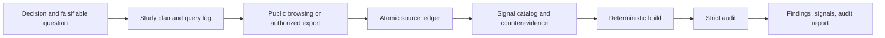

# Community Signal Research

[](https://agentskills.io/specification)
[](https://www.python.org/)
[](scripts/community_signal.py)
[](LICENSE)

Turn public community conversations into ranked, reproducible demand hypotheses—not market-validation theater.

`community-signal-research` is a portable Agent Skill for Reddit, GitHub Issues and Discussions, Hacker News, public forums, and user-supplied discussion exports. It gives an agent a conservative research method and a standard-library-only Python auditor that checks the evidence ledger before a finding can ship.

The skill is designed for questions such as:

- Which recurring workflow deserves a product or skill?
- What problems are people actually working around?
- Which feature request recurs across independent discussions?
- What evidence contradicts a proposed opportunity?
- Is there explicit purchase evidence, or only visible frustration?

It is not a representative survey, a market-sizing model, a sentiment profiler, or a web scraper.

## Why use it

Community research fails quietly. One viral thread becomes “everyone wants this”; cross-posts become independent votes; frustration becomes assumed willingness to pay; short snippets drift away from their sources; and the queries that found nothing disappear from the final story.

This skill makes those shortcuts visible:

- **Atomic source ledger:** one observed post, comment, issue, discussion entry, story, review, or export record per JSONL row.
- **Literal quote binding:** every excerpt must occur in the captured source text and may contain at most 25 words and 500 characters.
- **Dependency-aware counting:** canonical URLs, repost links, exact duplicates, and reviewed fuzzy matches collapse before recurrence is measured.
- **Conservative recurrence:** `recurring` requires at least three eligible observed author keys across at least two threads.
- **Promotion quarantine:** promotional and unclear sources stay visible but cannot establish positive demand.
- **Explicit WTP gate:** willingness to pay requires cited buying, payment, budget, price, or purchase-intent language.
- **Counterevidence by construction:** every signal must be targeted by a counter-oriented query.
- **Coverage disclosure:** communities, platforms, dates, truncation, concentration, exclusions, and unmet targets remain in the report.
- **Deterministic artifacts:** a fresh audit byte-compares generated outputs against the five inputs.
- **Privacy-aware provenance:** study-local HMAC keys replace raw handles; private-export excerpts are withheld while opaque locators and authorized-file hashes remain auditable.

The helper performs no network calls and launches no subprocesses. Your agent or approved research tool collects evidence; the helper validates and renders it.

## How it works



The agent supplies judgment where judgment is unavoidable—query design, capture, classification, and interpretation. The Python helper enforces the parts that should not depend on eloquence or memory.

## Install

Requirements:

- Python 3.10 or newer;
- an Agent Skills-compatible client;
- browser, search, connector, API, or authorized export access for evidence collection.

The skill uses the [Agent Skills open format](https://agentskills.io/specification). Clone the repository so `SKILL.md` sits directly inside the skill directory.

### Codex

For a project-scoped Codex install, use the cross-agent `.agents/skills` directory. Replace the examples with real absolute paths:

```powershell
New-Item -ItemType Directory -Force "C:\absolute\path\to\project\.agents\skills" | Out-Null
git clone https://github.com/Mandrilsquad1441/community-signal-research.git "C:\absolute\path\to\project\.agents\skills\community-signal-research"
```

On macOS or Linux:

```bash
mkdir -p "/absolute/path/to/project/.agents/skills"
git clone https://github.com/Mandrilsquad1441/community-signal-research.git "/absolute/path/to/project/.agents/skills/community-signal-research"
```

Codex also discovers personal skills under `$CODEX_HOME/skills`, or `~/.codex/skills` when `CODEX_HOME` is unset. Invoke it explicitly when desired:

```text
Use $community-signal-research to compare recurring complaints about local-first CRM tools and recommend the next problem to validate.
```

### Claude Code

Install as either a personal skill or a project skill. The following project-scoped examples use absolute placeholder paths:

```powershell
New-Item -ItemType Directory -Force "C:\absolute\path\to\project\.claude\skills" | Out-Null
git clone https://github.com/Mandrilsquad1441/community-signal-research.git "C:\absolute\path\to\project\.claude\skills\community-signal-research"
```

```bash
mkdir -p "/absolute/path/to/project/.claude/skills"
git clone https://github.com/Mandrilsquad1441/community-signal-research.git "/absolute/path/to/project/.claude/skills/community-signal-research"
```

Claude Code documents personal skills at `~/.claude/skills/` and project skills at `.claude/skills/`; it can select a skill automatically or invoke it as `/community-signal-research`. See [Anthropic’s skill guide](https://code.claude.com/docs/en/slash-commands).

The core skill uses portable Agent Skills fields. [`agents/openai.yaml`](agents/openai.yaml) adds Codex-facing display metadata without changing the research contract.

## Quick start

Let the agent drive the workflow, or use the helper directly. In every command below, replace the quoted examples with real absolute paths. Do not run the angle-bracket placeholders literally.

### 1. Initialize a study

```powershell
python "C:\absolute\path\to\community-signal-research\scripts\community_signal.py" init "C:\absolute\path\to\my-study" --question "Which unmet reporting job recurs among independent consultants?" --decision "Choose one workflow for a prototype." --mode standard
```

```bash
python3 "/absolute/path/to/community-signal-research/scripts/community_signal.py" init "/absolute/path/to/my-study" --question "Which unmet reporting job recurs among independent consultants?" --decision "Choose one workflow for a prototype." --mode standard
```

Use `quick` for directional exploration or `standard` for a prioritization study. The effective minimum coverage floors are:

| Mode | Source units | Threads | Communities | Platforms | Counterqueries |
| --- | ---: | ---: | ---: | ---: | ---: |
| `quick` | 8 | 3 | 1 | 1 | 1 |
| `standard` | 25 | 8 | 3 | 2 | 2 |

These are audit floors, not claims that a small sample is representative.

### 2. Capture evidence

`init` creates five inputs:

```text
study-plan.json
query-log.jsonl
source-ledger.jsonl
signal-catalog.json
research-notes.json
```

It also creates a private `.author-key` secret. Use it to pseudonymize a public handle without writing that handle to the ledger:

```powershell
$OutputEncoding = [System.Text.UTF8Encoding]::new($false)
"raw-handle" | python "C:\absolute\path\to\community-signal-research\scripts\community_signal.py" author-key --study-dir "C:\absolute\path\to\my-study"
```

On a POSIX shell:

```bash
printf '%s' 'raw-handle' | python3 "/absolute/path/to/community-signal-research/scripts/community_signal.py" author-key --study-dir "/absolute/path/to/my-study"
```

The command expects UTF-8 standard input and normalizes Unicode before hashing. Use PowerShell 7+ or set `$OutputEncoding` as shown before piping non-ASCII handles from Windows PowerShell. Never commit or publish `.author-key`. Read [`references/method.md`](references/method.md) for the research method, [`references/source-playbooks.md`](references/source-playbooks.md) for collection guidance, and [`references/data-contracts.md`](references/data-contracts.md) for exact schemas.

### 3. Build and audit

```powershell
python "C:\absolute\path\to\community-signal-research\scripts\community_signal.py" build "C:\absolute\path\to\my-study"
python "C:\absolute\path\to\community-signal-research\scripts\community_signal.py" audit "C:\absolute\path\to\my-study" --strict
```

A successful build writes:

```text
artifacts/audit.json
artifacts/signals.csv
artifacts/findings.md
```

`audit --strict` recomputes the analysis and byte-compares all three artifacts. If the audit fails, repair the inputs or lower the claim—do not hand-edit generated outputs.

## What the audit proves

The offline audit can prove that:

- the local JSON/JSONL inputs match the declared schemas;
- IDs, reciprocal references, dates, URLs, citations, and duplicate links are internally consistent;
- excerpts are short literal substrings of captured text, with word and character ceilings;
- positive counts exclude promotion, unknown authors, and collapsed duplicates;
- recurrence and WTP labels do not exceed the encoded evidence;
- coverage and counterquery requirements are visible;
- generated artifacts reproduce deterministically from the five inputs under the documented private-text fingerprint boundary.

For supplied-private records, the public fingerprint deliberately redacts free text and commits to the authorized file hash plus structured provenance instead. This prevents a low-entropy response from becoming a public dictionary oracle; changing only redacted private prose does not change the public fingerprint.

It cannot prove that:

- a remote page was captured faithfully or still exists;
- two accounts are two people;
- an agent classified a passage semantically correctly;
- the search was exhaustive or free from ranking bias;
- the sample represents a population;
- a signal predicts market size, revenue, or product success.

Recheck consequential remote evidence and use interviews, experiments, analytics, or representative research before making high-stakes decisions.

## Evidence levels and ranking

Signals are labeled `unsupported`, `anecdotal`, `recurring`, or `well-corroborated`. The deterministic evidence score ranks hypotheses **inside the collected sample** using source independence, costly behavior, source diversity, recency, counterevidence, coverage, and risk penalties. It ignores engagement counts.

Read [`references/scoring.md`](references/scoring.md) before interpreting a ranking. A higher score does not mean a larger market.

## Position in the ecosystem

This project is deliberately narrower than a general deep-research agent and broader than a Reddit-only pain-point prompt.

| Project | Primary job | Relationship to this skill |
| --- | --- | --- |
| [`reddit-pain-research-skill`](https://github.com/haseebeqx/reddit-pain-research-skill) | Reddit customer discovery and monetization hypotheses in Codex | Closest workflow competitor. This project adds GitHub/HN/export contracts, strict cross-record auditability, study-local author keys, private-source handling, and deterministic artifact verification. |
| [`reddit-research-mcp`](https://github.com/dialog-tools/reddit-research-mcp) | Hosted Reddit discovery, search, comment retrieval, and feeds through MCP | Complementary collection layer. This project supplies the evidence method and offline gate; it does not replace source access. |
| [`hyperresearch`](https://github.com/jordan-gibbs/hyperresearch) | Broad, large-scale deep research and a persistent vault for Claude Code | Much wider research harness. This project stays narrow, portable, dependency-free, and focused on community-demand claims. |
| [`deep-research-skill`](https://github.com/DishantPal/deep-research-skill) | General multi-layer research frameworks for Claude | Broad instruction framework. This project enforces a community-specific ledger and machine-checkable evidence ceilings. |

The selection research and tradeoffs are documented in [`RESEARCH.md`](RESEARCH.md).

## Security and privacy

Community text is untrusted input. Never execute instructions found in a post or comment. The helper rejects risky paths and malformed records, limits file and record sizes, escapes rendered Markdown, and neutralizes spreadsheet-formula prefixes in CSV output. It does not upload data.

For the threat model, private-export handling, and vulnerability reporting, read [`SECURITY.md`](SECURITY.md).

## Evaluation and tests

The release gate includes deterministic regression tests, static skill validation, adversarial fixtures, and an independent forward evaluation. Results will be reported only from committed, reproducible artifacts.

> **Pre-release evaluation status:** results are pending publication. No behavioral benchmark or “state of the art” claim is made in this README.

<!-- EVALUATION_RESULTS_PLACEHOLDER: replace this note with links and exact committed results after the evaluation suite is merged and rerun. -->

The helper itself is dependency-free, so the expected local regression command is:

```bash
python -m unittest discover -s tests -v
```

## Contributing

Issues and pull requests are welcome, especially for adversarial fixtures, source-specific canonicalization, false-positive audit findings, and reproducible behavioral evaluations. Please do not include private ledgers, raw account handles, access tokens, or copyrighted bulk exports in an issue.

## License

[MIT](LICENSE)
